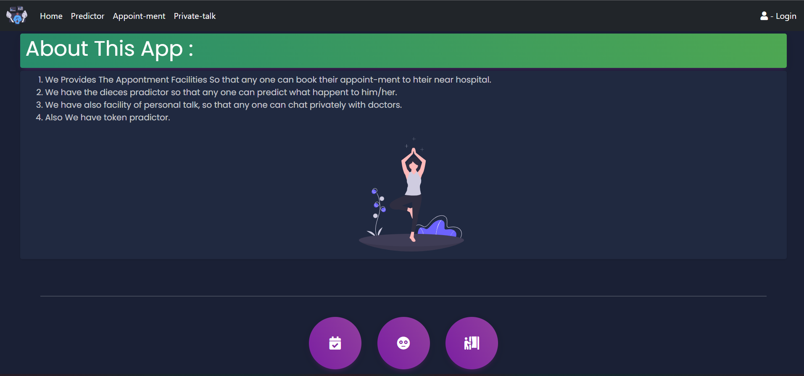
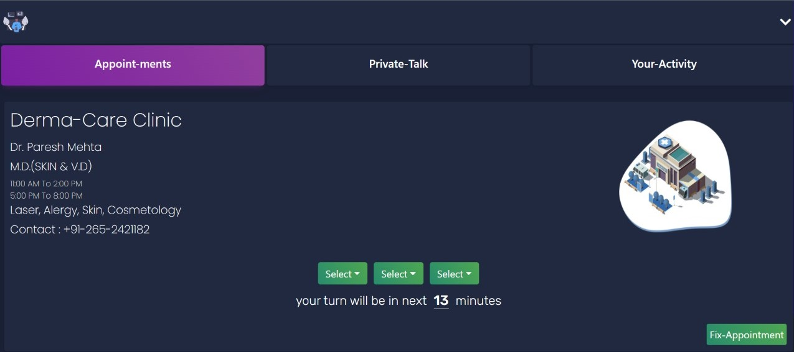
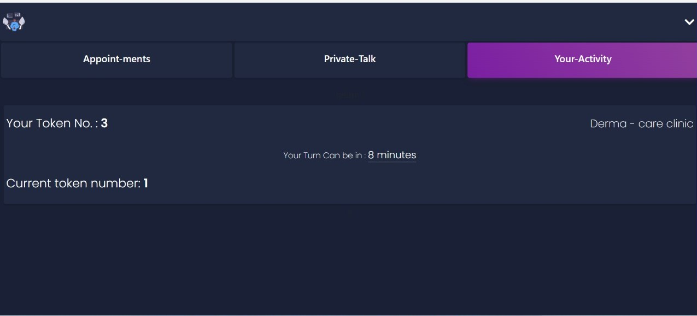
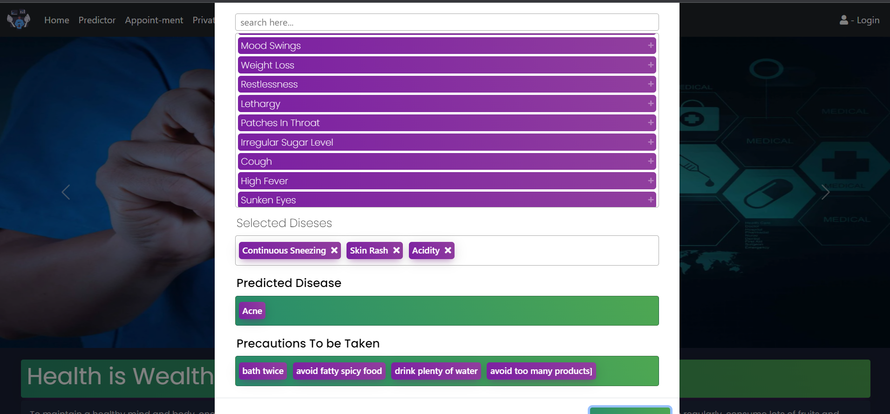
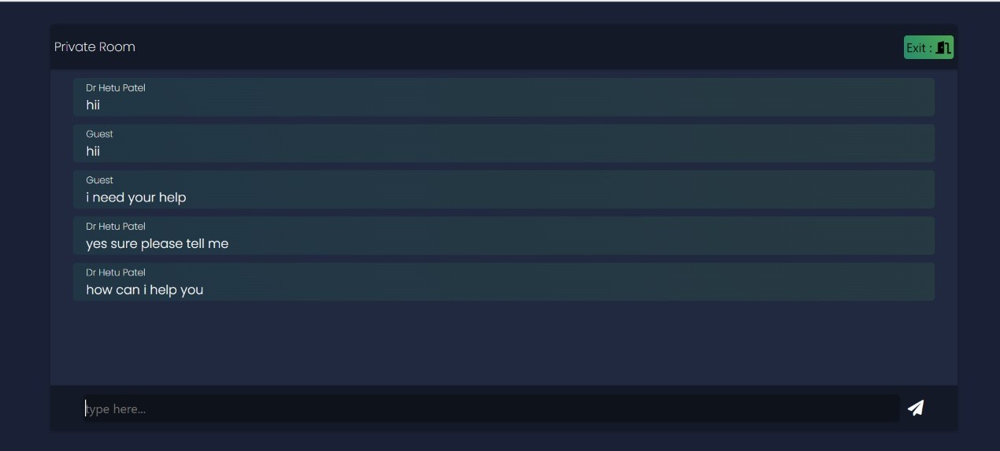

# DEV.HNZ

# Topic : Health is Wealth

## Youtube Link

[Youtube]()

<br/>

<p align="center">

</p>

# Problems Solved

```
- The patients have to wait a long time for their turn in clinics/hospitals.

- So, to solve this problem, we have created an online booking appointment.
- It also has a predicter which will help them to reach hospital on time.

- They can decide whenever they want to take an appointment so that they can save their time.

- The concerns of privacy and chat leak are resolved in the private chat with doctor, since socket.io is used for chatting and rooms.

- The problem of data leak will be solved in this model, because all the data is stored in Blockchain contract, and cannot be changed.
```
<p align="center">

</p>

# Feature 1

```
- Patients Can Book Appointment and Before booking  they will Get Predicted time which is implemented using [Linear Regression]

- After Booking The Details will be Shown in (Your-activity) Tab Which includes [The Token No.] and [Predicted Time left]

- The Patient cannot book a new appointment until his/her pending appointment is not completed.

- We wanted to use timer to show the time left for the appointment, but were not able to complete it.
```

<p align="center">

<br/>

</p>


# Feature 2

```
- Patient Can Talk Privetly With The Doctor in a Separate Room.

- Only One Patient Can Be in a Room At a time.

-The chats are deleted as soon as the patient leaves the room.

-We also tried to send request to doctor, whenever some patient wants to join room, but were not able to complete it.
```
<p align="center">

</p>

# Feature 3

```
- It is a predictor Where patients Can Add Two Or more Symptoms And Will Get Predicted [Disease] and [Precautions]

- It is based on [Naive Bayes] and [forest] methods.

```
<p align="center">

</p>


# About This App

```
- The patients Can Register using their etherium Account.

- While Registering The data is Stored in [ Block-Chain Contract ], which is much more safe than anyy other database

- The time predictor in appointment feature is based on [linear regression model].

- The Contact-Us form is connected woth Email-Js. The form submissions will be sent to our email-id.

- The admin account can be accesed only by the person who has the ethereum account which is mentioned in the appointment.js file.
```

###

## 🛠 Tech Used ||

```bash
Solidity (Block-Chain), Python (Machine Learning),
Numpy, Pandas, Sklearn, React.js, Node-JS, Socket.io, Ganache, HTML, CSS
```

## Deployed Link

```bash
    https://hospital-model.herokuapp.com/

```

## [Deployed - App](https://hospital-model.herokuapp.com/)

<br/>

## Problems faced

```
- We were not able to connect the blockchain part to the deployed website.

- The predicted model is not working on the deployed website due to request timeout.
```

## Developers

## [HETU](https://github.com/Hetu1107/), [NAITIK](https://github.com/Naitik6803), [ZAID](https://github.com/zaidm124)

<br/>

## Run Locally

Clone the project

```bash
  git clone https://github.com/Hetu1107/DEV.HNZ-DevHeat-2021
```

Go to the project directory

```bash
  cd DEV.HNZ-DEVHEAT-2021
```

Install dependencies

```bash
  npm install
```

Start the Node server

```bash
  nodemon server.js
```

Go to the client directory

```bash
  cd client
```

Install dependencies

```bash
  npm install
```

Start the server

```bash
  npm start
```

Connect to blockchain

```bash
    download ganache and add metamask extension
    Add a custom RPC netowrk
    Network Name: Ganache
    RPC URL: http://127.0.0.1:7545
    Chain Id: 1337
```
